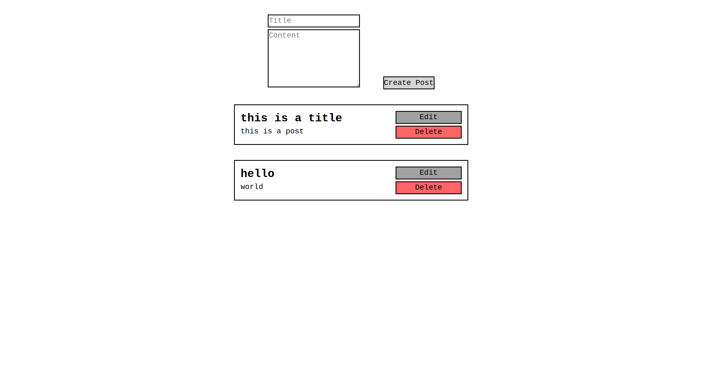

# Post REST API

A REST API to fetch, create, update, and delete posts.

## API Endpoints

### GET /api/posts

Fetches all posts.

### GET /api/posts/{id}

Fetches a post with the id `{id}`.

### POST /api/posts

Creates a post.

### PATCH /api/posts/{id}

Edits a post with the id `{id}`.

### DELETE /api/posts/{id}

Deletes a post with the id `{id}`.

## Local Setup

1. Clone the repository:

```
git clone https://github.com/shardhue/post-rest-api.git
```

2. Change directory to the post-rest-api folder:

```
cd post-rest-api
```

3. Install the Composer dependencies:

```
composer install
```

4. Install the NPM dependencies:

```
npm install
```

5. Create a .env file:

```
cp .env.example .env
```

6. Generate an app key:

```
php artisan key:generate
```

7. Start Apache and MySQL.

8. Login to MySQL:

```
mysql -u <username> -p
```

9. Create a database in MySQL called post_rest_api:

```
create database post_rest_api;
```

10. Exit out of MySQL:

```
exit
```

11. Run the database migrations:

```
php artisan migrate
```

### Running the project

Run the following commands to start the development servers:

```
npm run dev
php artisan serve
```

The project should now be up and running at the web server provided by `php artisan serve`.

## Front-End



The project also has a simple front-end that can be used to interact with the API.

It is located at the base `/` URL of the `php artisan serve` web server.